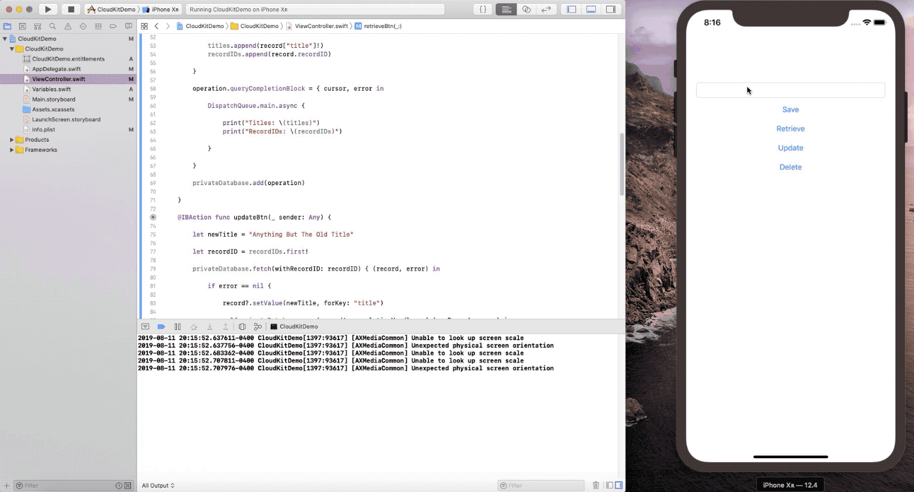

# CloudKitDemo

CloudKit demo app

## Requirements

- Xcode 10
- iOS 12

## How to build

- Change the **Team** setting in the **General** tab for each target.
- Build & Run with **Xcode 10**

## How to use

 - Type a "title" into the textField and click Save - you should see Record Saved in the output screen
 - Click Retrieve and you should see the titles array output with our one record that we have saved and the recordIDs array output with the ID of the one record we've saved
 - Click Update and it will fetch that ID we have for our one record and update it with the new title we have coded into the update function. Click Retrieve again and you should see the new title in the output screen
 - Click Delete and it will access that ID we have for our one record and it will delete it with the new title we have coded into the update function. Click Retrieve again and you should see two empty brackets in the output screen looking like this: []

## Known Issues

- N/A

## Author

**Eric Walker**

Software/hardware hobbyist in Akron Ohio

- GitHub Landing Page:  [My Work](https://ewalk40.github.io/)
- Social: [Twitter](https://twitter.com/ewalk40) / [LinkedIn](https://www.linkedin.com/in/eric-walker-003364117)
